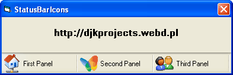



## StatusBar Icons

### Description

This source code adds icons to StatusBar control.
 
### More Info
 

             |
---                |---
**Submitted On**   |2005-05-30 21:57:52
**By**             |[djkprojects](https://github.com/Planet-Source-Code/PSCIndex/blob/master/ByAuthor/djkprojects.md)
**Level**          |Intermediate
**User Rating**    |4.8 (19 globes from 4 users)
**Compatibility**  |VB 6\.0
**Category**       |[Custom Controls/ Forms/  Menus](https://github.com/Planet-Source-Code/PSCIndex/blob/master/ByCategory/custom-controls-forms-menus__1-4.md)
**World**          |[Visual Basic](https://github.com/Planet-Source-Code/PSCIndex/blob/master/ByWorld/visual-basic.md)
**Archive File**   |[StatusBar\_1980143142006\.zip](https://github.com/Planet-Source-Code/djkprojects-statusbar-icons__1-64663/archive/master.zip)

